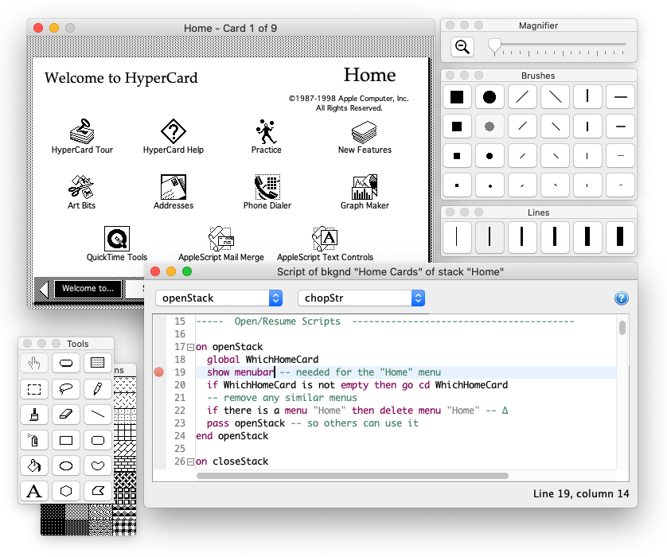

# WyldCard

[Features](#features) | [Getting Started](#getting-started) | [Building](doc/BUILDING.md) | [Scripting Guide](https://github.com/defano/wyldcard/wiki)

A reproduction of Apple's HyperCard, written in Java. Originally developed as a class project for a graduate-level compiler design course at DePaul University in Chicago. [Refer to the wiki](https://github.com/defano/wyldcard/wiki) for details.

 

## Features

WyldCard strives to offer a high-fidelity reproduction of Apple's original HyperCard, not a modernization of it:

* Cards support foreground and background layers; buttons and fields come in a variety of styles similar to HyperCard's; text fields can hold richly-styled text. Multiple stacks can be opened simultaneously in different windows.
* Paint and draw using all the original paint tools, patterns and image transforms (provided by the [JMonet library](https://www.github.com/defano/jmonet)). WyldCard supports full-color graphics and alpha transparency.
* Attach HyperTalk scripts to buttons, fields, cards, backgrounds and stacks; control the menu bar and address windows as objects. Most aspects of the HyperTalk 2.4.1 language have been implemented, including chunk expressions, message passing and context-sensitive evaluation of object factors. Sports a built-in step debugger with variable watching, message watching and in-context script execution.
* Compose music using HyperCard's original sound effects (`flute`, `harpsichord` and `boing`); `dial` telephone numbers; `speak` text; and animate cards with one of 23 visual effects provided by the [JSegue library](https://www.github.com/defano/jsegue).

#### What's missing?

* No home stack and no ability to inherit behavior from other stacks (i.e., `start using ...`).
* No concept of user levels and no report printing.
* Some parts of the HyperTalk language, especially those related to obsolete operating system or hardware capabilities (like AppleTalk), are missing.

## Getting started

Getting started is easy. What is it that you're interested in doing?

#### I want to download and play with this.

Someday an executable will be available for download, until then, see the [build guide](doc/BUILDING.md) for instructions on how to run the application using Gradle.

#### I'm a Java developer and want to contribute to the source code.

Glad to have you aboard! Have a look at [the build instructions](doc/BUILDING.md).

#### I want to run the real HyperCard.

Use the SheepShaver emulator to run Macintosh System Software on modern Macs and PCs. See [this tutorial](https://jamesfriend.com.au/running-hypercard-stack-2014) for details.

#### I'm an attorney looking for new work.

This project represents a homework assignment gone awry and is in no way associated with Apple's long-obsolete HyperCard application program. HyperCard&trade;, HyperTalk&trade; and any other trademarks used within are the property of FileMaker, Inc., Apple, Inc. and/or their rightful owner(s).

## Can I use this to open or edit old HyperCard stacks?

You can! Use the "Import HyperCard Stack..." command from the File menu. 

There are, of course, a few caveats:

* WyldCard can only import stacks produced by HyperCard 2.x. 1.x stacks can be converted to 2.x format simply by opening them with HyperCard 2.x (of course, you'll need an old Mac or SheepShaver to do so).
* WyldCard cannot import resources embedded in the stack file's resource fork (such as XCMDs, XFCNs, PICTs, SNDs or ICONs). Stacks that rely on these resources will not function correctly.
* Later versions of HyperCard shipped with several XCMDs and XFCNs that offered features like palette windows, picture viewers, and color images. The capabilities provided by these externals are not implemented in WyldCard.

**Bottom line:** WyldCard is not a perfect replica of HyperCard. Some functions are missing or behave differently than their HyperCard counterparts, and, as a result, some stacks (especially the most complex ones) will not behave correctly when imported into WyldCard. Your milage may vary.

## What's HyperCard? I wasn't around back then. 

Apple called HyperCard "programming for the rest of us." Steve Wozniak called it ["the best program ever written"](https://www.macworld.com/article/1018126/woz.html).

Released in 1987 and included in the box with every Macintosh sold during the late 1980's and '90s. HyperCard was a software [Erector Set](https://en.wikipedia.org/wiki/Erector_Set): part programming language, part paint program, part database. With HyperCard, you could draw a user interface with [MacPaint](https://en.wikipedia.org/wiki/MacPaint)-like tools, then apply scripts and behaviors to it with an expressive syntax that mimicked natural English.

Need more? [Watch an interview of HyperCard's creators](https://www.youtube.com/watch?v=BeMRoYDc2z8) Bill Atkinson and Dan Winkler on The Computer Chronicles, circa 1987.

#### Nu ar det slut...
